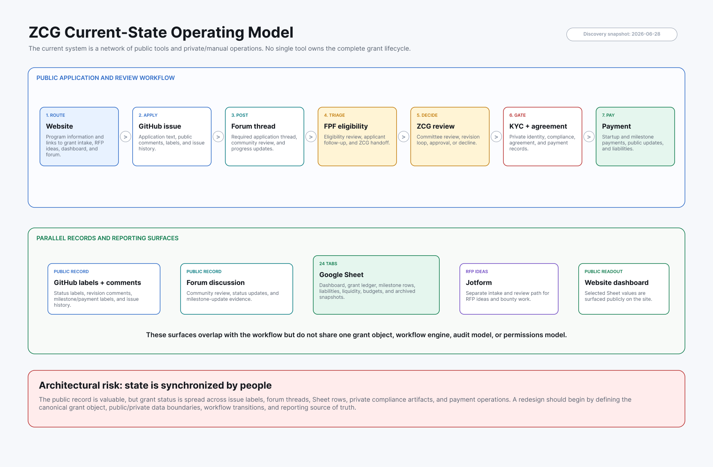
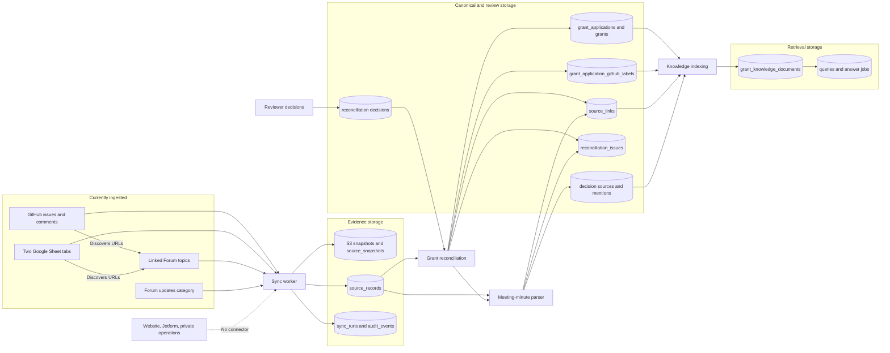

# ZCG Grants Prototype

An independent, working proposal for turning Zcash Community Grants (ZCG) from
a collection of manually synchronized public tools into a structured grants
operating system.

The prototype mirrors existing public records, preserves their provenance,
reconciles them into canonical applications and grants, and exposes public and
administrator views without asking ZCG to replace its current tools first.

- [Live prototype](https://zcg.pgpz.org)
- [ZCG Grants Dashboard](https://zcg.pgpz.org/dashboard)
- [Grounded grant knowledge search](https://zcg.pgpz.org/admin/knowledge)
- [Public grants API](https://zcg.pgpz.org/api/public/grants)
- [Health check](https://zcg.pgpz.org/api/health)

> **Status:** independent prototype and architecture proposal. It is not an
> official ZCG production system unless and until the relevant Zcash ecosystem
> stakeholders adopt it.

## Current Implementation at a Glance

| Area | Current state |
| --- | --- |
| Source mirroring | GitHub issues and comments, two public ZCG Google Sheet tabs, linked Zcash Community Forum topics, and the Forum's Community Grants Updates category |
| Evidence preservation | Checksum-tracked source records in PostgreSQL and optional aggregate JSON snapshots in private S3 |
| Reconciliation | Canonical applications, funded-grant records, GitHub label normalization, source links, confidence scores, generated issues, and durable reviewer decisions |
| Decision history | Meeting-minute topics parsed into decision sources and grant mentions with rationale, speaker notes, provenance, and review status |
| Knowledge retrieval | PostgreSQL full-text search, pgvector embeddings, hybrid retrieval, and optional citation-grounded answer composition |
| Product surfaces | Public read-only dashboard, application details, reconciliation workspace, knowledge search, user access management, and an allowlisted public API |
| Access and audit | Better Auth email codes, application-owned roles and permissions, server-side authorization, and audit events |
| Deployment | Next.js on AWS Amplify SSR, Aurora PostgreSQL through the RDS Data API, and CDK-managed workers, snapshots, secrets, logs, and optional alarms |

Not yet implemented as first-class workflow data: milestones, progress updates,
payment requests and disbursements, RFPs, KYC, agreements, attachments, an
applicant portal, or controlled writeback to the current public systems.

### Last-observed prototype corpus

These are reconciliation outputs, not authoritative ZCG production totals.
They were observed on the live prototype on **July 10, 2026** after source
syncs completed on July 9 and the decision-minute reconciliation was refreshed.

| Metric | Count |
| --- | ---: |
| Mirrored source records | 4,336 |
| Canonical applications | 624 |
| Funded-status grant records | 164 |
| Open reconciliation items | 31 |
| Open warning items | 19 |
| Grant knowledge documents | 6,052 |
| Embedded knowledge documents | 5,557 |

## How ZCG Operates Today

ZCG currently works across public routing, application intake, community
discussion, financial tracking, and private/manual operations. No single tool
owns the full grant lifecycle.



The diagram is based on public-system discovery performed on June 28, 2026.
The private/manual steps need validation with ZCG and Financial Privacy
Foundation (FPF) system owners. The
[editable Figma source](https://www.figma.com/design/R9cVXb7xXLK6b3mCWRBhDp)
and [detailed discovery notes](docs/zcg-current-state-discovery-refined.md)
record the evidence and open questions.

The documented public workflow is broadly:

1. The ZCG website routes an applicant to the GitHub grant issue form.
2. The applicant cross-posts the application to the Zcash Community Forum.
3. FPF performs eligibility review and coordinates revisions.
4. The community reviews the application publicly before ZCG decides.
5. FPF coordinates applicant notification, KYC, and the grant agreement.
6. Forum updates gate milestone payouts, while payment and portfolio summaries
   are maintained in the ZCG Google Sheet.

In parallel, GitHub labels and comments, Forum discussions, the Google Sheet,
Jotform RFP intake, meeting minutes, and private operational records each hold
part of the state. People are the integration layer that keeps those records
aligned.

## How Sources Map to Stored Data

The current prototype is deliberately read-only at the source boundary. It
**mirrors** public evidence, **reconciles** related records, and only then
publishes canonical and search-oriented views.



The dotted line means there is **no implemented connector** for the website,
Jotform, or private FPF/ZCG operations. They are shown so the absence is
explicit rather than silently treated as complete coverage.

### Source-to-table mapping

| Source or input | Mirrored storage | Canonical or derived storage |
| --- | --- | --- |
| GitHub issues | `source_records` as `github_issue` | `grant_applications`; normalized `grant_application_github_labels`; `source_links`; possible `grants` and `reconciliation_issues` |
| GitHub comments | `source_records` as `github_issue_comment` | Parent-application evidence; discovered Forum URLs can produce linked Forum records |
| ZCG Google Sheet | `google_sheet_tab` and `google_sheet_row` records for the configured All Grants Tracking and ZCG Grants/milestone-detail tabs | Historical applications, funded-status grants, source links, and reconciliation issues |
| Forum topics discovered in GitHub or Sheet data | `source_records` as `forum_link`, including topic metadata, posts, plain text, and rendered post HTML | Primary-thread or supporting-reference `source_links`; knowledge documents |
| Forum Community Grants Updates category | `forum_meeting_minutes` or `forum_update_topic` source records | Meeting minutes become `grant_decision_sources`, `grant_decision_mentions`, decision links, and review issues; generic update topics currently remain raw evidence |
| Reviewer judgments | Reconciliation UI/API or portable JSON import into `reconciliation_decisions` | Link/unlink decisions, application relationships, and issue resolutions are replayed after generated reconciliation; field-override decisions are persisted but not yet applied |
| Canonical, linked-source, and accepted decision evidence | Derived from the rows above | `grant_knowledge_documents` with full-text vectors and optional embeddings; `grant_knowledge_queries` and `grant_knowledge_answer_jobs` |
| Website, Jotform, KYC/agreement files, and payment/custody systems | Not ingested | No current tables or connectors |

Important boundaries:

- The operational Google Sheet has 24 documented tabs; only two are mirrored by
  default.
- A `grant_application` represents a proposal broadly. A `grant` is created only
  for applications normalized to `approved`, `active`, or `completed`.
- Milestone and payment detail is still source evidence and coarse summary data,
  not normalized milestone or payment objects.
- Forum topic mirroring defaults to at most 20 posts per topic.
- S3 snapshots are optional. When no snapshot bucket is configured, raw payloads
  still live in PostgreSQL `source_records`.

## Product Surfaces

| Route | Purpose | Access |
| --- | --- | --- |
| `/dashboard` | Source telemetry, canonical applications, filters, and evidence links | Authenticated roles, or public read-only mode |
| `/admin/grants/:id` | Application details, labels, sources, decisions, and reconciliation issues | Authenticated roles, or public read-only mode |
| `/admin/reconciliations` | Review and persist ambiguous source-to-application decisions | Public read-only mode; persistence requires reconciliation write access |
| `/admin/knowledge` | Keyword, semantic, hybrid, and grounded evidence search | Public keyword/evidence search; richer modes require permissions |
| `/admin` | Landing page for protected administrative functions | Administrator |
| `/admin/users` | Email and domain role grants | Administrator |
| `/api/public/grants` | Allowlisted public grant projection, currently capped at 100 rows | Public |
| `/api/health` and `/api/health/db` | Application and database health | Public deployment checks |

`PUBLIC_PROTOTYPE_READONLY=true` exposes selected server-rendered dashboard,
detail, reconciliation, and keyword-search views without enabling semantic
search, AI answers, user management, indexing, embedding, synchronization, or
writes.

## Runtime Architecture

- **Web:** Next.js 15, React 19, and TypeScript. The live web tier runs on AWS
  Amplify SSR and reaches private Aurora through an IAM compute role and the RDS
  Data API.
- **Database:** Aurora PostgreSQL 16.13 with pgvector. Local development can use
  PostgreSQL directly through `pg`; serverless routes and knowledge workers can
  use the Data API.
- **Source workers:** Lambda or local workers fetch public GitHub, Google Sheet,
  and Forum data, store optional snapshots in S3, and write source evidence to
  PostgreSQL.
- **Knowledge workers:** deployed index, embedding, and asynchronous answer
  workers use the Data API. Embeddings and answer composition use a configurable
  OpenAI-compatible endpoint.
- **Authentication:** Better Auth sends email one-time codes through SES in
  deployed environments and logs them to the server console locally when SES is
  unset.
- **Scheduling:** the embedding schedule can be enabled in CDK. The six-hour
  source-sync rule is defined but disabled by default, so source refreshes are
  currently operator-triggered.

### Repository map

| Path | Purpose |
| --- | --- |
| `app/` | Next.js pages, layouts, and route handlers |
| `app/admin/` | Dashboard, grant details, reconciliation, knowledge, and user access UI |
| `app/api/` | Health, auth, administration, synchronization, and public API routes |
| `lib/source-mirroring/` | GitHub, Google Sheet, and Forum collectors plus source storage |
| `lib/reconciliation/` | Canonical grant reconciliation, durable reviewer decisions, and meeting-minute parsing |
| `lib/knowledge/` | Knowledge documents, retrieval, embeddings, answer jobs, and composition |
| `lib/admin/` | Dashboard and user-management data access |
| `lib/auth.ts` and `lib/authorization.ts` | Authentication and server-side permission enforcement |
| `workers/` | Sync, migration, knowledge index, embedding, and answer workers |
| `migrations/` | Better Auth, authorization, source, canonical, decision, and retrieval schema |
| `infra/` | AWS CDK backend stack |
| `docs/` | Discovery, architecture, migration, reconciliation, and deployment notes |

## Local Development

### Requirements

- Node.js 24.x; repository tooling and containers currently pin `24.18.0`.
- npm 11.
- PostgreSQL 16 with the `pgvector` extension available.

An optional local database using Docker:

```bash
docker run --name zcg-postgres \
  -e POSTGRES_USER=zcg \
  -e POSTGRES_PASSWORD=zcg \
  -e POSTGRES_DB=zcg \
  -p 5432:5432 \
  -v zcg-postgres:/var/lib/postgresql/data \
  -d pgvector/pgvector:pg16
```

### Setup

```bash
npm ci
cp .env.example .env
```

Before continuing, set a strong `BETTER_AUTH_SECRET` in `.env`. To receive the
Administrator role on first sign-in, also set `BOOTSTRAP_ADMIN_EMAILS` to your
email address. The default `DATABASE_URL` matches the optional Docker database
above.

Standalone scripts and workers read process environment variables directly;
they do not load `.env` themselves. Export the file before running migrations or
workers:

```bash
set -a
source .env
set +a
npm run db:migrate
npm run dev
```

Open `http://localhost:3000/sign-in`. With `SES_FROM_EMAIL` unset, the one-time
sign-in code appears in the development-server console.

`npm run db:seed` is a legacy/manual seed path and requires `SEED_ADMIN_EMAIL`.
For a normal Better Auth sign-in, prefer `BOOTSTRAP_ADMIN_EMAILS` as described
above.

### Refresh the local corpus

The normal operator sequence is mirror, reconcile, rebuild the knowledge index,
and optionally embed documents:

Reliable full-corpus GitHub comment mirroring requires `GITHUB_TOKEN` or
`ZCG_GITHUB_TOKEN` with read-only Issues access; anonymous API rate limits are
usually too low for this workflow.

```bash
npm run worker:sync -- --reconcile
npm run knowledge:index
npm run knowledge:embed
```

The embedding command requires a configured embedding API key. Keyword search
works without embeddings or AI answer composition.

Useful maintenance commands:

```bash
npm run reconcile:grants
npm --silent run reconciliation:export > data/reconciliation-decisions.json
npm run reconciliation:import -- ./data/reconciliation-decisions.json
npm run worker:knowledge-index
npm run worker:knowledge-embed
npm run infra:synth
```

Run the repository checks with:

```bash
npm run check
```

`check` runs TypeScript checking, ESLint, and a production build. The repository
does not currently include an automated test suite.

## Deployment

The current public deployment combines:

- `amplify.yml` for the Amplify SSR web tier at `zcg.pgpz.org`;
- private Aurora PostgreSQL with the RDS Data API;
- an encrypted, versioned, non-public S3 snapshot bucket;
- Lambda workers for migration, synchronization, indexing, embedding, and
  grounded answer jobs;
- Secrets Manager, IAM roles, CloudWatch logs, and optional alarms; and
- an optional ECS/Fargate and load-balancer web path for production-style
  deployments.

Two CDK cost modes are available: `prototype-low-cost`, which omits the optional
ECS/ALB web tier and permits Aurora scale-to-zero, and `production-ready`, which
restores production-style web compute, minimum database capacity, monitoring,
and alarms.

See [AWS account portability](docs/deployment/aws-account-portability.md),
[Amplify target](docs/deployment/amplify-zcg-target.md),
[backend connection](docs/deployment/backend-connection-spike.md), and
[deployment cost modes](docs/deployment/cost-modes.md).

## Design and Data Principles

- **Preserve public trust.** Existing public records should remain available and
  traceable during any migration.
- **Migrate before replacing.** Read-only mirroring and explicit reconciliation
  should precede writeback or cutover.
- **Make provenance first-class.** Store source IDs, URLs, checksums, payloads,
  confidence, relationship roles, and reviewer rationale.
- **Surface uncertainty.** Unmatched rows, ambiguous titles, stale state, and
  missing links belong in a review queue rather than being hidden.
- **Separate public and private data.** KYC, agreements, payment instructions,
  custody, and internal deliberation require explicit private boundaries.
- **Publish from allowlists.** Public APIs and views should expose deliberate
  projections rather than raw operational rows.

This public repository must not contain production secrets or private
operational data. `.env.example` contains placeholders only; local environment
files and account-specific CDK context are ignored.

## Proposed Next Work

1. Normalize milestones, progress updates, payment requests, disbursements, and
   status timelines from the mirrored corpus.
2. Add reviewer-assisted status normalization and richer decision-link review.
3. Decide whether and how to mirror Jotform, website content, and approved
   private operational records.
4. Build dedicated public grant pages and exports from explicit projections.
5. Add applicant and FPF/ZCG workflow surfaces only after source confidence and
   privacy boundaries are agreed.
6. Define incremental sync, writeback, cutover, archive, and rollback policies
   with system owners.

The [architectural assessment](docs/zcg-architectural-assessment-refined.md)
contains the fuller target-system argument and proposed architecture.

## Documentation

- [Current-state discovery](docs/zcg-current-state-discovery-refined.md)
- [Architectural assessment](docs/zcg-architectural-assessment-refined.md)
- [Prototype development plan](docs/zcg-prototype-development-plan.md)
- [Phase 0 build checklist](docs/phase-0-build-checklist.md)
- [Phase 1 source mirroring](docs/phase-1-source-mirroring.md)
- [Manual reconciliation decisions](docs/manual-reconciliation-decisions.md)
- [Deployment cost modes](docs/deployment/cost-modes.md)
- [AWS account portability](docs/deployment/aws-account-portability.md)

## License, Governance, and Security

A license has not yet been selected. Before external contribution or production
adoption, the project should choose an open-source license, identify
maintainers, and document contribution, governance, and security-disclosure
processes.

If you discover a security issue, do not open a public issue containing exploit
details. Contact the repository owner privately until a formal security policy
is added.
