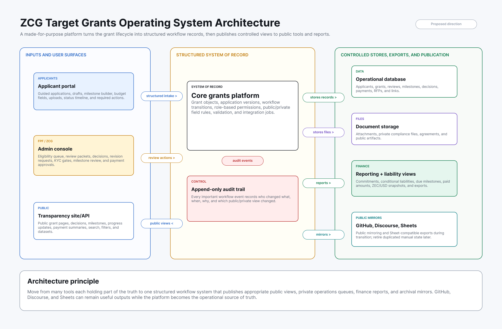

# ZCG Grants Prototype

A working proposal and prototype for re-architecting the Zcash Community Grants
systems.

This repository exists to make a practical case: Zcash Community Grants should
move from a human-synchronized network of GitHub issues, Discourse forum posts,
Google Sheets, public website links, Jotform intake, and private operational
steps toward a purpose-built grants operating system.

The goal is not to erase the public record or abruptly replace familiar tools.
The goal is to preserve transparency while creating one structured operational
model for applications, review, milestones, progress updates, payments,
reporting, audit, and eventual public publishing.

Prototype deployment: https://zcg.pgpz.org

> Status: independent prototype and architecture proposal. This is not an
> official ZCG production system unless and until the Zcash ecosystem and the
> relevant operating stakeholders adopt it.

## Why This Exists

The current ZCG process has grown around public, flexible, low-cost tools. That
was a reasonable starting point. GitHub issues provide public application
history. The Zcash Community Forum provides public discussion and progress
updates. Google Sheets provide treasury and grant tracking. The public website
routes applicants and community members to those systems.

The problem is that those tools do not share one grant object, one workflow
model, one audit trail, or one permission boundary.

The real operating system is therefore not GitHub, Sheets, or Discourse. It is
the human work required to keep them aligned.

That creates predictable problems:

- Status can mean a GitHub label, a Sheet row, a forum narrative, or private
  FPF/ZCG operational state.
- Milestones, payment requests, progress updates, and grant liabilities are
  spread across tools with different data shapes.
- Public and private data boundaries are conceptually mixed even when the data
  itself lives in different places.
- Applicants must navigate GitHub, forum posting, issue-form conventions, and
  follow-up requirements.
- Reporting depends on reconstructing workflow truth from public artifacts and
  manually curated spreadsheet rows.
- Historical continuity depends on links, labels, archived tabs, and human
  convention rather than a durable model.

The architectural smell is not that any one tool is bad. The smell is that each
tool holds part of the truth.

## Current State

The current ZCG system appears to involve at least these public and operational
surfaces:

- ZCG public website: public routing, program information, dashboard links, RFP
  links, and grant process guidance.
- GitHub issue-intake repository: grant applications submitted as issues, with
  labels acting as workflow state.
- Zcash Community Forum: required application threads, community review,
  applicant communication, and progress updates.
- Google Sheet: grant/milestone ledger, dashboards, payouts, distributions,
  budgets, liquidity, inputs, and archives.
- Jotform: RFP idea intake.
- FPF/ZCG manual operations: eligibility, KYC, agreements, payment approvals,
  committee coordination, and private records.


The diagram is intentionally busy. That is the point: the current system is a
network of useful tools, but not a coherent grants platform.

More detail is available in:

- [Current-state discovery](docs/zcg-current-state-discovery.md)
- [Refined current-state discovery](docs/zcg-current-state-discovery-refined.md)
- [Architectural assessment](docs/zcg-architectural-assessment.md)
- [Refined architectural assessment](docs/zcg-architectural-assessment-refined.md)

## Target Direction

The target architecture is a structured grants operating system that can import,
reconcile, govern, and publish the grant lifecycle.



The most important shift is:

> Move from many tools each holding part of the truth to one structured workflow
> system publishing appropriate views to many tools.

The intended target system should include:

- Applicant portal for guided submissions, drafts, milestones, budgets,
  supporting documents, status timelines, progress updates, and payment
  requests.
- FPF/ZCG admin console for eligibility, community review, committee review,
  decisions, KYC/agreement gates, milestones, payment review, and portfolio
  operations.
- Public transparency layer for grant pages, statuses, source links,
  milestones, progress updates, public payment summaries, and exports.
- Reporting and finance layer for commitments, liabilities, ZEC/USD valuation
  snapshots, paid milestones, and historical reporting.
- Source mirroring and reconciliation for GitHub, Sheets, Discourse, Jotform,
  and later approved private operational records.
- Append-only audit and explicit public/private projection boundaries.

## Ethos

This work is guided by a few operating principles.

### Preserve Public Trust

ZCG has a public legitimacy requirement. GitHub issues, forum discussions,
public dashboards, and historical records should not disappear behind a private
tool. A better system should preserve and improve transparency, not reduce it.

### Migrate Before Replacing

The safe path is sync-first. Mirror current systems, reconcile records into a
canonical grants model, expose gaps, and only then introduce controlled
writebacks or replacement workflows. A clean-room rewrite would lose too much
context and create too much adoption risk.

### Make Source Evidence First-Class

Every imported record should keep its source ID, source URL, raw snapshot, and
link to the canonical grant object. The system should be able to explain why it
believes two records refer to the same grant.

### Separate Public and Private Data

Public transparency and private operations must be modeled deliberately. KYC,
agreements, payment instructions, internal deliberation, and sensitive
compliance data need stronger boundaries than public application text or forum
updates.

### Build Audit In From Phase 0

Audit, authorization, and public projection rules are not afterthoughts. They
are part of the core architecture because the system will eventually touch
workflow decisions, status changes, private data boundaries, and payment-state
records.

### Improve Applicant Experience Without Losing Openness

GitHub is powerful for technical contributors, but ZCG should be accessible to
excellent applicants who do not live in GitHub. A purpose-built portal can guide
people through the process while still publishing appropriate public records.

### Be Honest About Uncertainty

This prototype should surface reconciliation issues rather than hiding them.
Unmatched Sheet rows, missing forum links, status conflicts, low-confidence
matches, and stale state are not failures. They are exactly the kind of
operational ambiguity a better system must expose.

## What Has Been Built

The current prototype is focused on Phase 0 and the beginning of Phase 1/2:
deployment packaging, authentication, source mirroring, canonical
reconciliation, and an internal admin view.

Current capabilities include:

- Next.js 15 application with React 19 and TypeScript.
- Node 24 local/container/runtime posture.
- Better Auth email one-time-code authentication.
- Server-side role and permission checks.
- Postgres data model for principals, roles, permissions, audit events, source
  snapshots, source records, source links, sync runs, reconciliation issues,
  canonical applications, and grants.
- AWS CDK infrastructure for portable deployment packaging.
- AWS Amplify SSR deployment for `zcg.pgpz.org`.
- RDS Data API backend connection for Amplify-hosted SSR routes.
- Source mirroring from:
  - GitHub issues.
  - Public Google Sheet CSV exports.
- Reconciliation engine that:
  - normalizes GitHub application issues into canonical application records,
  - groups Google Sheet grant rows by project,
  - matches GitHub issues to Sheet projects by title confidence,
  - creates canonical grants,
  - attaches source evidence,
  - surfaces reconciliation issues,
  - extracts and associates Zcash Community Forum links already present in
    mirrored sources.
- Admin dashboard with:
  - source record counts,
  - canonical application and grant counts,
  - reconciliation issue summary,
  - matched, GitHub-only, Sheet-only, and needs-review filters,
  - server-side search,
  - pagination,
  - application detail pages with source evidence and reconciliation issues.
- Public grants API with allowlisted public projection.

At the time of this README update, the live prototype reconciliation has
produced:

| Metric | Count |
| --- | ---: |
| GitHub issue source records | 319 |
| Google Sheet row source records | 810 |
| Canonical application records | 400 |
| Canonical grant records | 173 |
| Forum links associated from mirrored sources | 142 |
| Canonical applications with forum-link evidence | 63 |
| Open generated reconciliation issues | 336 |

These numbers are prototype reconciliation outputs, not final ZCG production
truth. They are useful because they show both the value and the messiness of the
existing data model.

## Why This Is a Credible Next Step

This repository is not only a written proposal. It is already wired to real
source systems and real deployment infrastructure.

The prototype demonstrates that it is possible to:

- Import public ZCG source systems without disrupting them.
- Preserve raw source evidence.
- Build a canonical grant model incrementally.
- Show cross-source match quality instead of pretending the data is clean.
- Identify missing or mismatched source relationships.
- Keep public projection separate from admin workflows.
- Deploy with repeatable AWS packaging rather than a one-off local demo.

That is the right kind of proof for a project like this. ZCG should not approve
a big-bang rewrite. It should approve a careful, evidence-backed migration path
that earns trust by reconciling the real corpus first.

## Proposed Project Path

### Phase 0 - Foundation

Status: substantially implemented in this prototype.

- App scaffold.
- Auth decision and Better Auth implementation.
- Role/permission/audit model.
- Deployment packaging.
- Database migrations.
- Health checks.
- Portable AWS posture.

### Phase 1 - Source Mirroring

Status: started.

- Mirror GitHub issue records.
- Mirror public Google Sheet rows.
- Store source records and source snapshots.
- Track sync runs.
- Preserve source URLs, IDs, checksums, and metadata.
- Add Discourse/Jotform mirroring next, subject to API/access decisions.

### Phase 2 - Reconciliation Console

Status: started.

- Canonical application and grant model.
- GitHub-to-Sheet matching.
- Forum link association from existing source payloads.
- Admin filters, search, pagination, and application detail pages.
- Reconciliation issue generation.

Next work:

- Add first-class Discourse topic/post mirror.
- Build richer milestone and payment extraction.
- Add manual reconciliation workflow for resolving unmatched records.
- Add status normalization review UI.
- Add application/grant timeline.

### Phase 3 - Public Transparency Prototype

Planned.

- Public grant directory.
- Public grant detail pages.
- Public status timeline.
- Source-linked milestones, progress updates, and payment summaries.
- CSV/JSON exports.

### Phase 4 - Applicant and Operations Workflow

Planned after source confidence is established.

- Applicant portal.
- Draft application workflow.
- Guided milestone and budget builder.
- Progress update submission.
- Payment request submission.
- Committee/FPF review queues.
- Controlled writeback previews to public systems.

### Phase 5 - Cutover Planning

Planned only after stakeholder approval.

- Decide which system becomes authoritative for which object.
- Define public mirror policy for GitHub/forum.
- Define Sheet export policy.
- Define rollback and archive strategy.
- Migrate operational ownership with explicit controls.

## Architecture Overview

The prototype separates three layers:

1. Raw source evidence: snapshots and records from existing systems.
2. Source mirror tables: source-specific records with source IDs, URLs,
   timestamps, checksums, and metadata.
3. Canonical grants model: normalized applications, grants, source links,
   reconciliation issues, and future workflow objects.

Key local areas:

| Path | Purpose |
| --- | --- |
| `app/` | Next.js application routes and UI |
| `app/admin/` | Protected admin dashboard and application detail pages |
| `app/api/` | Health, auth, admin, sync, and public API routes |
| `lib/source-mirroring/` | GitHub and Google Sheet mirror collectors |
| `lib/reconciliation/` | Canonical grant reconciliation engine |
| `lib/admin/` | Dashboard and admin data access |
| `lib/auth.ts` | Better Auth configuration |
| `lib/authorization.ts` | Server-side permission enforcement |
| `migrations/` | Database schema migrations |
| `workers/` | Sync worker and migration runner |
| `infra/` | AWS CDK stack |
| `docs/` | Discovery, assessment, deployment, and prototype planning docs |

## Public and Private Boundaries

This repo is public, but it should never contain secrets or private operational
data.

Current rules:

- `.env.example` contains placeholders only.
- `.env` and `.env.*` are ignored except `.env.example`.
- `cdk.context.json` is ignored because it can include account-specific context.
- Private KYC, agreements, payment instructions, treasury custody operations,
  and internal deliberation are out of scope for public commits.
- Public APIs should be generated from explicit allowlisted projections.
- Admin routes must enforce server-side permissions.

## Local Development

Requirements:

- Node 24.x. Local tooling currently pins `24.18.0`.
- npm 11.
- PostgreSQL for local database work, or RDS Data API configuration for the
  deployed environment.

Setup:

```bash
npm ci
cp .env.example .env
npm run db:migrate
npm run db:seed
npm run dev
```

Useful commands:

```bash
npm run check
npm run worker:sync
npm run reconcile:grants
npm run infra:synth
```

The deployed prototype uses AWS-managed secrets and environment variables. Do
not copy production secrets into local files or commits.

## Deployment Posture

The repository includes both:

- `amplify.yml` for the public web tier on AWS Amplify SSR.
- CDK infrastructure for backend packaging, workers, database, snapshots,
  secrets, roles, logs, and alarms.

The current deployment target is `zcg.pgpz.org`, with Amplify handling the
web-tier deployment and custom domain. Backend state is private and accessed
through the selected backend boundary.

See:

- [AWS account portability](docs/deployment/aws-account-portability.md)
- [Amplify target](docs/deployment/amplify-zcg-target.md)
- [Backend connection spike](docs/deployment/backend-connection-spike.md)

## Documentation Map

- [Current-state discovery](docs/zcg-current-state-discovery.md)
- [Current-state discovery, refined](docs/zcg-current-state-discovery-refined.md)
- [Architectural assessment](docs/zcg-architectural-assessment.md)
- [Architectural assessment, refined](docs/zcg-architectural-assessment-refined.md)
- [Prototype development plan](docs/zcg-prototype-development-plan.md)
- [Phase 0 build checklist](docs/phase-0-build-checklist.md)
- [Phase 1 source mirroring](docs/phase-1-source-mirroring.md)
- [AWS account portability](docs/deployment/aws-account-portability.md)
- [Amplify target](docs/deployment/amplify-zcg-target.md)
- [Backend connection spike](docs/deployment/backend-connection-spike.md)

## Stewardship Case

This work should be evaluated as an ecosystem infrastructure proposal, not just
as an app build.

The Zcash ecosystem should want ZCG operations to be:

- easier for applicants,
- clearer for reviewers,
- safer for private operational data,
- more auditable for the community,
- less dependent on manual synchronization,
- better at preserving historical context,
- and more capable of producing public transparency artifacts on demand.

The right mandate is not "replace everything immediately." The right mandate is
"lead a careful transition from scattered public tools into a coherent grants
operating system, while preserving public trust and historical continuity."

This repository is intended to make that transition concrete enough to discuss,
test, fund, critique, and improve.

## License and Governance

A license has not yet been selected. Before external contribution or production
adoption, the project should choose an open-source license, define maintainers,
and document contribution, security disclosure, and governance expectations.

## Security

If you discover a security issue in this prototype, do not open a public issue
with exploit details. Contact the repository owner privately until a formal
security policy is added.
