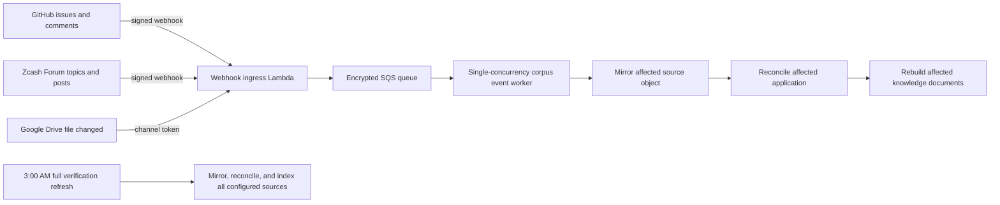

# Hybrid corpus refresh

Date: 2026-07-15

The hybrid refresh path keeps the existing full-corpus workflow as a safety net
while adding small, event-driven updates for sources that can notify the
prototype when something changes.

## Operating model



The event path is additive. It does not remove or replace:

- the Admin **Refresh corpus** control;
- the daily 3:00 AM `America/New_York` Step Functions workflow;
- the durable full-refresh and reconciliation leases; or
- the hourly embedding catch-up worker.

Both paths use the same durable corpus lease. Events wait and retry when a full
refresh owns it; a full refresh that encounters a short targeted update waits a
minute and retries rather than skipping its verification run. Delivery IDs are
recorded in `idempotency_keys`, so source-system retries do not apply the same
change twice. A standard SQS queue buffers bursts, a 60-second batching window
coalesces nearby notifications, and a dead-letter queue retains events that
repeatedly fail.

## Deployment and callback URLs

Deploy the backend normally:

```bash
AWS_PROFILE=zodldashboard AWS_REGION=us-east-1 \
  npm run infra:deploy:prototype-low-cost -- \
  --profile zodldashboard --region us-east-1 --require-approval never
```

The stack outputs include:

- `CorpusWebhookUrl`
- `CorpusEventQueueUrl`
- `CorpusEventDeadLetterQueueUrl`
- `CorpusWebhookIngressFunctionName`
- `CorpusEventWorkerFunctionName`
- `GitHubWebhookSecretArn`
- `DiscourseWebhookSecretArn`
- `GoogleDriveChannelTokenSecretArn`

Append the provider path to `CorpusWebhookUrl`:

| Provider | Callback URL |
| --- | --- |
| GitHub | `${CorpusWebhookUrl}github` |
| Zcash Discourse Forum | `${CorpusWebhookUrl}discourse` |
| Google Drive | `${CorpusWebhookUrl}google-drive` |

CDK creates random provider secrets when no existing secret is supplied. The
secret values are never placed in CloudFormation outputs or the repository.
Retrieve one only while registering its callback:

```bash
AWS_PROFILE=zodldashboard AWS_REGION=us-east-1 \
  aws secretsmanager get-secret-value \
  --secret-id SECRET_ARN \
  --query SecretString \
  --output text
```

Generated values are JSON in the form `{"secret":"..."}`. Existing secrets
can instead be selected through the CDK contexts `githubWebhookSecretId`,
`discourseWebhookSecretId`, and `googleDriveChannelTokenSecretId`.

## GitHub activation

The first deployment does not create a GitHub webhook. A repository
administrator can activate it in the source repository's webhook settings:

1. Set the payload URL to the GitHub callback URL above.
2. Select `application/json`.
3. Retrieve the secret value using `GitHubWebhookSecretArn` and the Secrets
   Manager command above, then copy the JSON `secret` value into the webhook
   secret field.
4. Subscribe to **Issues** and **Issue comments**.
5. Keep SSL verification enabled.
6. Confirm a GitHub `ping` delivery receives HTTP `202`.

GitHub signs each request with `X-Hub-Signature-256`; the ingress rejects a
missing or invalid signature before queueing anything. See GitHub's
[webhook event reference](https://docs.github.com/en/webhooks/webhook-events-and-payloads)
and [signature validation guidance](https://docs.github.com/en/webhooks/using-webhooks/validating-webhook-deliveries).

The event worker mirrors just the affected issue and its comments, reconciles
the corresponding application, follows any newly discovered Forum links, and
rebuilds knowledge documents only for the affected application. A deletion or
unresolvable issue retires any funded projection without deleting its canonical
history and is flagged for full verification rather than assigned a guessed
outcome. Events for another repository and pull-request comments are ignored.

## Zcash Discourse Forum activation

This step requires administrator access to the Zcash Community Forum. Ask a
Forum administrator to create a webhook with:

1. the Discourse callback URL above;
2. the value stored at `DiscourseWebhookSecretArn`;
3. JSON payloads; and
4. topic and post events, initially scoped to the relevant grant categories if
   the Forum configuration supports that filter.

Discourse signs deliveries in `X-Discourse-Event-Signature`. The ingress checks
that HMAC before accepting the notification. See Discourse's
[webhook configuration guide](https://meta.discourse.org/t/configure-webhooks-that-trigger-on-discourse-events-to-integrate-with-external-services/49045).

The event worker refreshes only topics already linked to a known grant or
previously mirrored as grant evidence. A signed event for an unknown topic is
acknowledged and ignored without expanding the corpus.

## Google Drive and Sheet activation

Google Drive change notifications are useful as a low-cost signal, but they do
not contain the changed rows. The initial hybrid implementation therefore
authenticates and records a relevant file notification, then marks it as
requiring a full source verification. It does not silently start a heavy full
refresh for every notification.

Activation requires a Google identity that can watch the official Sheet:

1. create a Drive API watch channel for the configured file;
2. use the Google Drive callback URL above as the HTTPS address;
3. use the value stored at `GoogleDriveChannelTokenSecretArn` as the channel
   token;
4. optionally deploy `googleDriveChannelId` and `googleDriveFileId` context
   values to reject notifications for any other channel or file; and
5. renew the channel before its expiration.

Drive channels expire and notification bodies do not identify cell-level
changes. See Google's [push notification guide](https://developers.google.com/workspace/drive/api/guides/push).
Until a reliable row-delta strategy is added, the 3:00 AM full refresh remains
the authoritative recovery path for Sheet changes.

## Transition sequence

1. **Deploy dormant infrastructure.** No source behavior changes until callback
   registration. Verify invalid requests receive `401` or `403` and the nightly
   schedule still exists.
2. **Activate GitHub.** Observe successful deliveries, targeted sync runs, queue
   age, and the next full verification result.
3. **Activate Discourse with a Forum administrator.** Compare targeted updates
   with the following full refresh before widening category coverage.
4. **Add the Drive watch when access is available.** Treat it as an early-change
   signal while retaining scheduled verification.
5. **Reassess cadence only after evidence.** Do not reduce the daily full
   verification schedule until several complete cycles show no missed changes.

## Verification and rollback

Read the current outputs:

```bash
AWS_PROFILE=zodldashboard AWS_REGION=us-east-1 \
  aws cloudformation describe-stacks \
  --stack-name ZcgPrototypeStack \
  --query 'Stacks[0].Outputs[?starts_with(OutputKey, `Corpus`)]' \
  --output table
```

Inspect queue depth and the dead-letter queue from the AWS console or with
CloudWatch metrics. Targeted executions also create `sync_runs` and audit
events, so the Telemetry page remains the primary application-level view.

Rollback is deliberately simple:

1. disable the provider webhook or Drive watch at the source;
2. leave the existing full refresh enabled;
3. investigate or redrive the dead-letter queue; and
4. redeploy with `-c enableHybridCorpusRefresh=false` only if the receiver and
   queue resources themselves must be removed.

Disabling the hybrid path does not disable the current Admin or scheduled full
refresh workflow.
