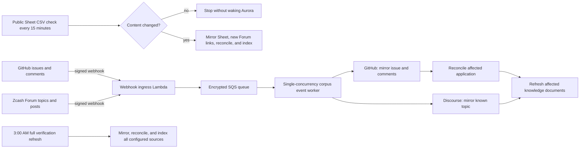

# Hybrid corpus refresh

Date: 2026-07-15

The hybrid refresh path keeps the existing full-corpus workflow as a safety net
while adding small, event-driven updates for sources that can notify the
prototype and a checksum-gated poll for the public Google Sheet exports.

## Operating model



The event path is additive. It does not remove or replace:

- the Admin **Refresh corpus** control;
- the daily 3:00 AM `America/New_York` Step Functions workflow;
- the durable full-refresh and reconciliation leases; or
- the hourly embedding catch-up worker.

The resulting refresh matrix is:

| Trigger | Normal scope | Mutation path | Recovery path |
| --- | --- | --- | --- |
| GitHub webhook | One configured-repository issue and its comments, including label changes | Encrypted SQS queue → targeted mirror → affected-application reconciliation and knowledge refresh | Delivery retry/DLQ, then the next full refresh |
| Discourse webhook | One already-known or linked grant topic/post | Encrypted SQS queue → targeted Forum mirror → affected-application knowledge refresh | Delivery retry/DLQ, then the next full refresh |
| Google Sheet schedule | Read-only checksum of every configured public CSV tab | Stop when unchanged; changed-Sheet Step Functions workflow when different | Later poll and the nightly full refresh |
| Daily schedule | All configured GitHub, Sheet, linked Forum, and Forum Updates sources | Full Standard Step Functions workflow at 3:00 AM Eastern | Operator rerun from Admin or Step Functions |
| Admin **Refresh corpus** | Same scope as the daily run | The same full Standard Step Functions workflow | Operator inspection and rerun |

The Sheet checker runs outside the VPC. It downloads the same two public CSV
exports used by the existing mirror and compares a deterministic content hash
with an S3 marker. It is deliberately read-only with respect to that marker: it
reports the observed checksum but never commits processing state. An unchanged
check does not connect to PostgreSQL, invoke the sync worker, or rebuild the
index. A changed check enters a Sheet-only Step Functions workflow that uses the
same shared corpus lease as the other paths.

The changed workflow passes the poller's checksum to `MirrorChangedGoogleSheet`
as `expectedGoogleSheetChecksum`. The mirror verifies that the content it
actually fetched still has that checksum before applying it, so an edit between
the poll and mirror cannot cause the workflow to acknowledge different content.
The successful corpus-refresh completion operation writes the S3 marker before
releasing the shared lease. This same completion boundary is used by both the
Sheet-only path and the full refresh. The marker therefore advances only after
mirroring, authoritative pruning, reconciliation, knowledge indexing, and
workflow completion all succeed.

All mutation paths use the same durable corpus lease. Targeted events use a
30-minute lease by default and return the SQS delivery for retry when a full or
Sheet refresh owns it. Changed-Sheet runs use a 75-minute lease and a one-hour
state-machine timeout; they wait in 60-second increments for a targeted event,
but stop cleanly when a full or another Sheet refresh already owns the lease so
a later poll can retry. Full runs use a five-hour lease and a 255-minute
state-machine timeout. They wait in 60-second increments for targeted or Sheet
work, preserving the original three-hour work budget after a possible
75-minute wait, and stop cleanly only when another full run is already active.
Expired leases are reclaimable and any abandoned parent `sync_runs` record is
marked failed.

Delivery IDs are recorded in `idempotency_keys`, so source-system retries do not
apply the same change twice. A standard SQS queue buffers bursts, a 60-second
batching window coalesces nearby notifications, the event worker has reserved
concurrency of one, and a dead-letter queue retains events that repeatedly fail.

## Deployment and callback URLs

Deploy the backend normally:

```bash
AWS_PROFILE=zodldashboard AWS_REGION=us-east-1 \
  npm run infra:deploy:prototype-low-cost -- \
  --profile zodldashboard --region us-east-1 --require-approval never
```

The stack outputs include:

- `CorpusWebhookUrl`
- `CorpusEventQueueUrl`
- `CorpusEventDeadLetterQueueUrl`
- `CorpusWebhookIngressFunctionName`
- `CorpusEventWorkerFunctionName`
- `GoogleSheetRefreshStateMachineArn`
- `GoogleSheetPollWorkerFunctionName`
- `GitHubWebhookSecretArn`
- `DiscourseWebhookSecretArn`
- `GoogleDriveChannelTokenSecretArn`

Append the provider path to `CorpusWebhookUrl`:

| Provider | Callback URL |
| --- | --- |
| GitHub | `${CorpusWebhookUrl}github` |
| Zcash Discourse Forum | `${CorpusWebhookUrl}discourse` |
| Google Drive | `${CorpusWebhookUrl}google-drive` |

CDK creates random provider secrets when no existing secret is supplied. The
secret values are never placed in CloudFormation outputs or the repository.
Retrieve one only while registering its callback:

```bash
AWS_PROFILE=zodldashboard AWS_REGION=us-east-1 \
  aws secretsmanager get-secret-value \
  --secret-id SECRET_ARN \
  --query SecretString \
  --output text
```

Generated values are JSON in the form `{"secret":"..."}`. Existing secrets
can instead be selected through the CDK contexts `githubWebhookSecretId`,
`discourseWebhookSecretId`, and `googleDriveChannelTokenSecretId`.

## GitHub activation

The first deployment does not create a GitHub webhook. A repository
administrator can activate it in the source repository's webhook settings:

1. Set the payload URL to the GitHub callback URL above.
2. Select `application/json`.
3. Retrieve the secret value using `GitHubWebhookSecretArn` and the Secrets
   Manager command above, then copy the JSON `secret` value into the webhook
   secret field.
4. Subscribe to **Issues** and **Issue comments**.
5. Keep SSL verification enabled.
6. Confirm a GitHub `ping` delivery receives HTTP `202`.

GitHub signs each request with `X-Hub-Signature-256`; the ingress rejects a
missing or invalid signature before queueing anything. See GitHub's
[webhook event reference](https://docs.github.com/en/webhooks/webhook-events-and-payloads)
and [signature validation guidance](https://docs.github.com/en/webhooks/using-webhooks/validating-webhook-deliveries).

The event worker mirrors just the affected issue and its comments, reconciles
the corresponding application, follows any newly discovered Forum links, and
rebuilds knowledge documents only for the affected application. A deletion or
unresolvable issue retires any funded projection without deleting its canonical
history and is flagged for full verification rather than assigned a guessed
outcome. Events for another repository and pull-request comments are ignored.

Issue-label edits are normal `issues` events and therefore use this same path.
That matters because the committee-review gate is derived from the current
GitHub labels rather than from a separate local promotion action.

## Zcash Discourse Forum activation

This step requires administrator access to the Zcash Community Forum. Ask a
Forum administrator to create a webhook with:

1. the Discourse callback URL above;
2. the value stored at `DiscourseWebhookSecretArn`;
3. JSON payloads; and
4. topic and post events, initially scoped to the relevant grant categories if
   the Forum configuration supports that filter.

Discourse signs deliveries in `X-Discourse-Event-Signature`. The ingress checks
that HMAC before accepting the notification. See Discourse's
[webhook configuration guide](https://meta.discourse.org/t/configure-webhooks-that-trigger-on-discourse-events-to-integrate-with-external-services/49045).

The event worker refreshes only topics already linked to a known grant or
previously mirrored as grant evidence. A signed event for an unknown topic is
acknowledged and ignored without expanding the corpus.

## Official committee-review gate

FPF assignment remains the source of truth for whether a proposal has entered
ZCG committee review. Reconciliation sets a GitHub application to
`under_review` only when the issue has both canonical labels:

- `Grant Application`; and
- `Ready For ZCG Review`.

The comparison is case-insensitive and ignores label emoji and punctuation, but
requires both complete canonical names; look-alike or partial labels do not
qualify. A Sheet value such as “review” or “discuss” remains evidence, but it
cannot promote the application by itself and instead produces a reconciliation
warning when the GitHub assignment labels are missing. Explicit terminal states
such as approved, declined, withdrawn, cancelled, filtered, and completed retain
their normal source precedence.

Committee-briefing generation is allowed only for an officially assigned
`under_review` application. This gate does not revoke public access to a shared,
successfully generated briefing that already exists.

## Google Sheet polling

No Google identity, service-account key, Drive API access, or FPF security-policy
change is required. The deployed Sheet mirror already reads the configured
public CSV exports. EventBridge Scheduler starts the lightweight checksum
workflow every 15 minutes by default.

Configure the path with CDK context when needed:

- `enableGoogleSheetPollSchedule` enables or disables the schedule and defaults
  to the `enableWorkers` value;
- `googleSheetPollMinutes` changes the cadence and must be at least 5; and
- `googleSheetId` and `googleSheetTabs` retain their existing meanings.

When content changes, the workflow mirrors every configured tab, deletes stale
rows only within those returned tab namespaces, mirrors newly discovered Forum
topics, reconciles the canonical registry, and rebuilds knowledge documents.
The embedding worker still embeds only missing or content-changed documents on
its normal schedule. If any processing step fails, the successful-checksum
marker is not updated and a later poll retries the same content. The poll Lambda
never has a separate `commit` action; committing the checksum belongs to the
lease-holding corpus completion operation so there is no interval in which the
marker claims success after the lease has been released.

On the first deployment, the marker does not exist. The first scheduled check
therefore reports the current Sheet as changed and intentionally starts a
one-time Sheet-only bootstrap refresh. Monitor that execution through completion
rather than treating it as an unexpected change. Its successful completion
creates the initial marker. Independently, every successful nightly full refresh
also writes the checksum of the Sheet content it processed, so the 3:00 AM run
advances or repairs the polling baseline even when the polling schedule was
disabled or a prior Sheet-only execution failed.

The Google Drive callback remains deployed but dormant for rollback and future
experimentation. Do not register or renew a Drive watch for normal operation.
Drive notifications do not identify changed rows and are no longer required for
Sheet freshness. The 3:00 AM full refresh remains the authoritative recovery
and cross-source verification path.

## Transition sequence

1. **Deploy additive infrastructure.** The checksum schedule starts immediately.
   Because a new deployment has no marker, expect and monitor one intentional
   Sheet-only bootstrap execution; subsequent unchanged checks stop before
   database work. Verify invalid callback requests receive `401` or `403` and
   the nightly schedule still exists.
2. **Activate GitHub.** Observe successful deliveries, targeted sync runs, queue
   age, and the next full verification result.
3. **Activate Discourse with a Forum administrator.** Compare targeted updates
   with the following full refresh before widening category coverage.
4. **Verify Sheet polling.** Confirm the bootstrap or a known Sheet edit produces
   a `google-sheet-refresh` sync run, that its successful completion writes the
   marker, and that the next unchanged execution stops after the checksum check.
5. **Verify the assignment gate.** Confirm a draft or Sheet-only review status
   stays out of the committee worklist, then confirm adding both official GitHub
   labels promotes the application after the targeted event is processed.
6. **Reassess cadence only after evidence.** Do not reduce the daily full
   verification schedule until several complete cycles show no missed changes.

## Verification and rollback

Read the current outputs:

```bash
AWS_PROFILE=zodldashboard AWS_REGION=us-east-1 \
  aws cloudformation describe-stacks \
  --stack-name ZcgPrototypeStack \
  --query 'Stacks[0].Outputs[?starts_with(OutputKey, `Corpus`) || starts_with(OutputKey, `GoogleSheet`)]' \
  --output table
```

Inspect queue depth and the dead-letter queue from the AWS console or with
CloudWatch metrics. The stack creates queue-age and dead-letter alarms even in
low-cost mode. Inspect the two Standard Step Functions state machines and the
poll Lambda logs for workflow-level failures. Targeted and changed-Sheet
executions also create `sync_runs` and audit events, so `/admin/telemetry`
remains the primary application-level view.

Cutover is healthy when:

- valid GitHub and Discourse test deliveries receive `202`, while invalid
  signatures receive `401` or `403`;
- queue age returns to zero and the dead-letter queue stays empty;
- a source edit appears as a targeted `sync_runs` entry without a full refresh;
- unchanged Sheet checks stop before database work, while a changed check
  completes and advances the S3 marker; and
- the following 3:00 AM full run succeeds without unexplained reconciliation or
  index drift.

Rollback is deliberately simple:

1. disable the provider webhook at the source, redeploy with
   `-c enableHybridCorpusRefresh=false` to remove the receiver/consumer path, or
   set `-c enableGoogleSheetPollSchedule=false` independently for Sheet polling;
2. leave the existing full refresh enabled;
3. investigate or redrive the dead-letter queue; and
4. use Admin **Refresh corpus** to run an immediate full verification if needed.

`enableHybridCorpusRefresh` controls the signed callback receiver, queue, and
targeted event worker; it does not control the independent Sheet polling
schedule. Disabling either incremental path does not disable the Admin or
scheduled full refresh workflow. Set `enableSourceSyncSchedule=false` only when
the daily safety-net schedule itself must be disabled.
