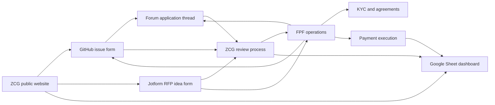
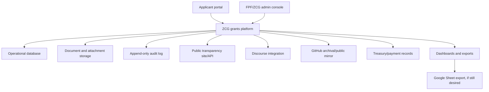

# ZCG architectural assessment and redesign case

Date: 2026-06-28

This assessment assumes the current-state discovery in `docs/zcg-current-state-discovery.md` is broadly accurate: ZCG is operating across a live website, a GitHub issue-intake repo, GitHub labels, required forum threads, a large Google Sheet, Jotform RFP intake, and FPF/ZCG manual workflows.

## Executive assessment

Your instinct looks correct: the ZCG system is due for architectural redesign and simplification.

The current architecture appears to have grown organically around public transparency and low-cost tooling. That made sense early on: GitHub issues, Discourse threads, and Google Sheets are familiar, public, flexible, and inexpensive. But the system now appears to be carrying responsibilities that these tools were not designed to handle as a coherent grant-management platform:

- Public grant intake.
- Eligibility triage.
- Community review.
- Committee review and decisioning.
- Applicant revision loops.
- KYC and grant-agreement gating.
- Milestone and deliverable tracking.
- Required progress reporting.
- Payment approval and payment-state tracking.
- Treasury and liability reporting.
- RFP idea intake and bounty tracking.
- Historical transparency and public reporting.

The current approach works because humans bridge the gaps. That is the architectural smell. The real system is not GitHub, Sheets, or Discourse individually; it is the human process required to keep them aligned.

A made-for-purpose system would not necessarily need to eliminate GitHub, Discourse, or Sheets immediately. The better architectural goal is to establish one durable operational source of truth, then publish or synchronize selected public records outward.

## As-is architecture

The current architecture can be summarized like this:

This is not a bad set of tools. The problem is that state is distributed across tools that do not share a single grant object, a single workflow engine, a single audit model, or a single permissions model.

## Architectural concerns

### 1. No clear system of record

Different systems appear authoritative for different slices of the same grant:

- GitHub issue: application text, public comments, labels.
- Forum thread: community review, public updates, applicant communication.
- Google Sheet: portfolio, milestones, amounts, payments, liabilities, status summaries.
- FPF/ZCG internal process: eligibility, KYC, grant agreement, payment approvals, committee operations.

This creates source-of-truth ambiguity. For example, "grant status" may mean the GitHub label state, the Sheet grant status, the forum narrative, or internal FPF state.

### 2. Workflow state is encoded as labels and rows

GitHub labels are being used as a lightweight state machine: approved, declined, KYC required, milestone complete, startup payment complete, grant complete, and so on. Labels are useful for visibility, but they are weak as an operational workflow model:

- They do not enforce allowed transitions.
- They do not require structured transition reasons.
- They do not capture who approved what in a purpose-built audit trail.
- They do not model dates, due dates, blockers, dependencies, or required documents cleanly.
- They become awkward for repeated objects such as milestones and payments.

The Sheet has the parallel problem: rows are flexible, but the meaning of each row depends on convention, formulas, tab context, and manual discipline.

### 3. Public and private data boundaries are mixed conceptually

The grant process needs both transparency and confidentiality:

- Public: application, forum discussion, approval/decline outcome, milestones, progress updates, public payment status.
- Private: identity, KYC, grant agreements, payment instructions, sensitive compliance material, internal deliberation, possibly conflicts and votes.

The current tools do not naturally enforce this boundary. GitHub and Discourse are public-first. Sheets can be shared but are not a purpose-built permissions boundary for sensitive workflow state. A made-for-purpose system can make privacy boundaries explicit at the data-model level.

### 4. Manual synchronization is operational debt

The current process likely depends on people keeping the same grant aligned across:

- GitHub issue labels and comments.
- Forum thread links and updates.
- Sheet rows and formulas.
- Internal FPF status.
- Public website/dashboard references.

Manual synchronization works until volume, turnover, urgency, or edge cases rise. Then the system becomes brittle in quiet ways: stale labels, missing links, inconsistent amounts, outdated statuses, late progress updates, and hard-to-answer audit questions.

### 5. Reporting is downstream of a spreadsheet, not native to the workflow

The Sheet is doing a lot of valuable work: treasury dashboarding, liabilities, grant rows, disbursements, current and archived snapshots. But a spreadsheet is a reporting and analysis surface, not a durable workflow backend.

When reporting is built on manually curated rows, every operational ambiguity becomes a reporting ambiguity:

- Which milestone is due?
- Which update is missing?
- Which approved grants are awaiting KYC?
- Which payment requests are approved but unpaid?
- Which liabilities are conditional versus committed?
- Which public page or forum thread is canonical for a grant?

These questions should be generated from structured workflow records, not reconstructed from multiple public artifacts.

### 6. Applicant experience is fragmented

Applicants currently need to understand GitHub, forum posting, public comments, issue-form conventions, milestone YAML, and follow-up expectations. GitHub is excellent for developers but can be alienating or confusing for non-technical applicants.

That creates a program-design tradeoff:

- GitHub gives transparency and public history.
- A purpose-built portal gives guidance, validation, status clarity, and lower applicant friction.

The target architecture can preserve public transparency while improving applicant experience.

### 7. Historical continuity is fragile

The system has historical artifacts: old grant platform links, archived Sheet tabs, old dashboards, GitHub issue history, Discourse threads, and legacy domains. This is normal, but in the current architecture those artifacts are not unified into a durable historical model.

A redesign should treat migration and archival integrity as first-class goals. ZCG's public legitimacy depends partly on being able to explain past decisions and payments cleanly.

## Why a made-for-purpose system

A made-for-purpose ZCG system would provide a coherent data model, workflow engine, permissions model, and reporting layer for the grant lifecycle.

The goal is not just "a nicer form." The goal is an operational system that understands what a grant is.

Core objects should include:

- Applicant.
- Organization.
- Grant application.
- Application version.
- Eligibility review.
- Forum/community review record.
- Committee review.
- Decision.
- Grant agreement.
- Milestone.
- Deliverable.
- Progress update.
- Payment request.
- Payment approval.
- Payment/disbursement.
- Ledger transaction.
- RFP idea.
- RFP.
- Bounty.
- Attachment.
- Public audit event.

Once these objects exist, public GitHub issues, forum posts, dashboards, and reports can become outputs or integrations rather than the only place where state lives.

## Target architecture

A pragmatic target architecture could look like this:

The most important architectural shift is this:

> Move from "many tools each holding part of the truth" to "one structured workflow system publishing appropriate views to many tools."

## Recommended product surfaces

### Applicant portal

- Guided grant application form.
- Draft saving and application version history.
- Milestone builder with validation.
- Budget builder.
- Supporting document upload.
- Clear status timeline.
- Required action list.
- Forum-post guidance and link tracking.
- Progress update submission.
- Payment/milestone request submission.

### FPF/ZCG admin console

- Intake queue.
- Eligibility review.
- Forum-post verification.
- Community-review window tracking.
- Committee review packet.
- Decision recording.
- Applicant revision requests.
- KYC and agreement status gates.
- Milestone and deliverable tracking.
- Progress update review.
- Payment-request review and approval workflow.
- Liability and payout dashboard.
- RFP idea review and bounty tracking.

### Public transparency layer

- Public grant pages.
- Application text and version history where public.
- Forum thread links.
- Committee decision summaries.
- Milestones and current status.
- Public progress updates.
- Public payment summaries.
- Search and filters by category, status, grantee, year, amount, and funding source.
- Exportable public datasets.

### Reporting and finance layer

- Approved commitments.
- Conditional commitments.
- Future liabilities.
- Paid milestones.
- Upcoming payment needs.
- ZEC/USD basis and valuation snapshots.
- Grant-category reporting.
- Historical snapshots.
- Audit exports.
- Sheet-compatible exports during transition.

## Benefits of redesign

### Operational clarity

A single system can answer basic questions without reconciliation:

- What is the current status of this grant?
- What is blocking it?
- Who owns the next action?
- Is community review complete?
- Is KYC complete?
- Is the agreement signed?
- Which milestone is due?
- Has the required forum update been posted?
- Has payment been approved?
- Has payment been executed?

### Reduced manual work

Automated reminders, validation, state transitions, and cross-linking would reduce manual coordination:

- Auto-create or verify forum links.
- Auto-remind applicants about missing updates.
- Auto-flag missing documents.
- Auto-calculate review windows.
- Auto-generate committee review packets.
- Auto-update public grant pages.
- Auto-export Sheet/reporting data.

### Better applicant experience

Applicants get a clear path instead of a scattered toolchain:

- Fewer assumptions about GitHub fluency.
- Better validation before submission.
- Clear requirements before and after approval.
- Less uncertainty about status and next steps.
- Easier progress and milestone reporting.

### Better governance and auditability

Structured workflow records give ZCG and FPF a defensible operating trail:

- Who changed status and when.
- Which version was approved.
- Which milestones were accepted.
- Which payment requests were approved.
- Which requirements were satisfied before payout.
- Which public disclosures were made.

This matters because grant programs are public-trust systems.

### Stronger public transparency

A purpose-built system can make transparency easier, not weaker:

- Public grant pages can be clearer than raw GitHub issues.
- Public exports can be consistent and machine-readable.
- Community members can track status without parsing labels and Sheet tabs.
- Historical grant data can be preserved and searchable.

The system can still mirror public records to GitHub or Discourse where culturally useful.

### Cleaner privacy boundaries

Role-based access can separate:

- Public community data.
- Applicant-private draft data.
- Committee review data.
- FPF compliance data.
- Finance/payment data.

This reduces accidental exposure risk and makes it easier to reason about what belongs where.

### Better financial and liability management

The current Sheet contains valuable financial logic, but a system can make commitments and payments native:

- Approved amount.
- Startup amount.
- Milestone amount.
- Paid amount.
- Future committed liability.
- Conditional liability.
- Cancelled/returned funds.
- ZEC/USD valuation snapshot.
- Funding source.
- Payment method/status.

This would reduce the risk of spreadsheet drift and make dashboard values traceable to underlying events.

### Institutional continuity

A made-for-purpose system reduces dependency on tacit knowledge:

- New committee members can see process history.
- FPF staff can follow runbooks embedded in the workflow.
- Auditors/community members can inspect public history.
- Future migrations become easier because data is structured.

## What not to do

Avoid a big-bang replacement that tries to eliminate every existing tool immediately.

The current system has social legitimacy because GitHub, Discourse, and Sheets are visible and familiar. A redesign should not accidentally reduce transparency or break community habits. The better path is progressive consolidation:

1. Model the data.
2. Import and reconcile history.
3. Add an internal workflow/admin layer.
4. Publish better public views.
5. Gradually replace intake and reporting surfaces once trust is established.

## Suggested implementation path

### Phase 0: process confirmation

Document and confirm:

- Who owns each current tool.
- Which records are authoritative.
- Which statuses are public/private.
- Which events must be auditable.
- Which reports are required.
- Which workflows are mandatory versus informal.

Deliverables:

- Current-state runbooks.
- Data dictionary.
- Public/private data map.
- Source-of-truth decision matrix.

### Phase 1: data foundation

Create a normalized grants database and import pipeline:

- Import GitHub issues, labels, comments, and issue-template fields.
- Import Sheet tabs and preserve formulas/values as evidence.
- Import or link Discourse topics.
- Import Jotform RFP idea submissions if access is granted.
- Build matching logic between issue, forum thread, Sheet rows, and project.

Deliverables:

- Canonical grant/application/milestone/payment schema.
- Historical reconciliation report.
- Admin-only read model.
- Public-data export.

### Phase 2: internal operating console

Build FPF/ZCG workflows first, while keeping public intake mostly unchanged:

- Intake triage.
- Eligibility review.
- Community-review tracking.
- Committee decision logging.
- KYC/agreement gating.
- Milestone and progress-update tracking.
- Payment approval checklist.
- Reporting exports back to Sheet.

Deliverables:

- Admin console.
- Audit log.
- Role-based permissions.
- Notifications/reminders.
- Sheet export parity.

### Phase 3: public transparency site

Publish structured public grant pages:

- Application summary.
- Public status timeline.
- Forum links.
- Decision summaries.
- Milestones.
- Updates.
- Payment summaries.
- Search/filter/export.

Deliverables:

- Public grants directory.
- Public API or CSV exports.
- Historical archive.

### Phase 4: applicant portal

Replace or augment GitHub issue intake:

- Draft applications.
- Guided milestone builder.
- Budget validation.
- Attachment uploads.
- Forum cross-post guidance.
- Required action timeline.
- Progress updates and milestone payment requests.

Deliverables:

- Applicant accounts or secure magic-link access.
- Application submission.
- Update/payment request flow.
- Optional GitHub/forum public mirroring.

### Phase 5: advanced finance and governance

Add deeper finance/governance capabilities:

- Payment batch preparation.
- Multisig/payment evidence linking.
- Liability forecasting.
- Conflict disclosure workflow.
- Committee vote recording if desired.
- Audit/reporting exports.

Deliverables:

- Finance dashboard.
- Treasury/liability reports.
- Governance/audit reports.

## Integration strategy

The system should integrate with existing tools rather than pretending they do not matter.

### GitHub

Short term:

- Continue issue intake.
- Import issues and labels.
- Link issues to canonical grant records.

Medium term:

- Mirror public application records or status updates back to GitHub if community expectations require it.

Long term:

- Decide whether GitHub remains an official public record or becomes an archive/mirror.

### Discourse

Short term:

- Link required forum threads.
- Track review windows and update requirements.

Medium term:

- Use Discourse API to verify forum posts and updates.
- Publish selected system events back to forum threads.

Long term:

- Preserve Discourse as the main community discussion layer.

### Google Sheets

Short term:

- Treat Sheets as reporting outputs and historical source material.

Medium term:

- Export generated reports to Sheets for continuity.
- Gradually move formulas into tested backend calculations.

Long term:

- Keep Sheets as optional analyst/reporting views, not the operational backend.

### Jotform

Short term:

- Export/import RFP ideas.

Medium term:

- Replace with native RFP idea intake or integrate via webhook.

Long term:

- Manage RFP ideas and bounties in the same platform as grants.

## Architecture principles

- Preserve transparency while reducing operational sprawl.
- Separate public records from private compliance and payment records.
- Make every important workflow event structured and auditable.
- Treat payments and liabilities as first-class objects.
- Avoid spreadsheet formulas as hidden business logic.
- Keep community discussion in community-native spaces unless there is a strong reason to move it.
- Design for historical import and reversible migration.
- Prefer incremental replacement over a big-bang cutover.

## Risks of redesign

| Risk | Mitigation |
| --- | --- |
| Loss of public trust if the system feels less transparent | Publish public grant pages, exports, and audit events from day one |
| Migration complexity | Start with read-only imports and reconciliation before changing intake |
| Process ambiguity discovered late | Run process-confirmation workshops before implementation |
| Sensitive data exposure | Define role-based access and public/private fields before building |
| Overbuilding | Phase implementation around highest-friction workflows first |
| Community resistance to leaving GitHub/forum | Keep GitHub/Discourse integrations and public mirroring during transition |
| Spreadsheet logic drift | Preserve Sheet exports until backend reports are trusted |

## Success metrics

Operational:

- Time from submission to eligibility decision.
- Time from eligibility to committee decision.
- Number of grants with missing forum links.
- Number of overdue progress updates.
- Number of payment requests missing required artifacts.
- Manual Sheet edits required per month.

Data quality:

- Percentage of grants with matched issue, forum thread, milestones, and payment rows.
- Number of status mismatches across systems.
- Number of unmatched historical records.
- Report generation time.

Applicant experience:

- Application completion rate.
- Number of avoidable incomplete submissions.
- Applicant time to understand next action.
- Support messages caused by process confusion.

Transparency:

- Public grants with complete status timelines.
- Public payment summaries traceable to approved milestones.
- Downloadable public dataset freshness.

## Bottom line

The strongest architectural case for redesign is not aesthetics or modernization. It is that ZCG appears to have outgrown a toolchain where operational truth is distributed across issues, labels, forum posts, spreadsheet rows, and private manual steps.

A made-for-purpose system would let ZCG keep the best parts of the current model - transparency, community review, public history, low barrier to observation - while reducing the hidden coordination burden on FPF, committee members, applicants, and anyone trying to understand the state of grants.

The right redesign is a grants operating system: structured records, explicit workflow, public transparency, private compliance controls, durable reporting, and integrations with the community spaces that already matter.
