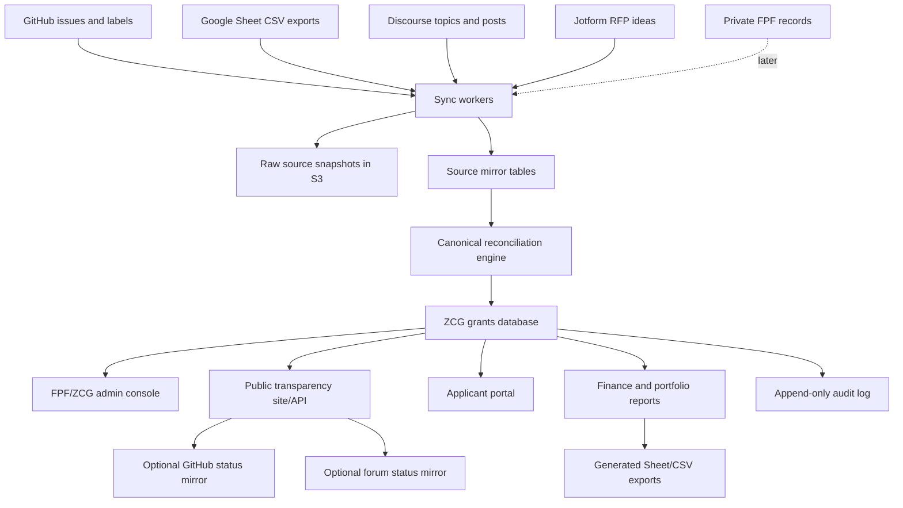

# ZCG prototype development plan

Date: 2026-06-28

## Purpose

This plan defines a prototype path for a made-for-purpose Zcash Community Grants operating system. The goal is not to pitch a greenfield rewrite. The goal is to build a credible production-data prototype that proves ZCG and FPF can move from a human-synchronized network of GitHub, Discourse, Google Sheets, Jotform, and private FPF operations into one structured workflow system with clear public/private boundaries.

The prototype should be convincing because it works against the real grant corpus from day one. That means the first product milestone is not a new intake form. It is a sync and mirroring layer that imports current public systems into a normalized store, shows reconciliation gaps, and lets reviewers inspect the current portfolio through a coherent grants model.

## Baseline assumptions

The current public system includes:

- The ZCG public website in `ZcashCommunityGrants/zcashcommunitygrants.github.io`.
- The issue-intake repo in `ZcashCommunityGrants/zcashcommunitygrants`.
- GitHub issue labels acting as a workflow state machine.
- Required Zcash Community Forum application and update threads.
- A public Google Sheet with grants, milestones, IC payouts, budgets, liquidity, distribution, all-grants tracking, inputs, and archived tabs.
- Jotform RFP idea intake.
- FPF and ZCG manual operations for eligibility, KYC, agreements, payments, committee coordination, and private records.

The target architecture should preserve public trust and public history while reducing manual synchronization. GitHub, Discourse, Sheets, and Jotform should initially be treated as source systems and mirrors, not as systems to abruptly remove.

## Architecture fit with sibling systems

The prototype should follow the same general operating style as sibling systems such as Zodl Dashboard, X Monitor, and PGPZ Community:

- **Web app:** Next.js 15, React 19, TypeScript, Node 24 LTS.
- **Hosting:** AWS Amplify SSR for the main application.
- **Portable AWS deployment package:** CDK-managed ECS Fargate service with a private Aurora PostgreSQL database for Phase 0 account portability.
- **Auth:** Better Auth for self-hosted authentication and session management, with app-owned role-based authorization.
- **Data:** RDS Postgres as the primary grants/workflow store, because grants, milestones, payments, liabilities, reconciliation, and audit events are relational and reporting-heavy.
- **Auxiliary storage:** DynamoDB is acceptable for sessions, short-lived caches, idempotency locks, or admin queues where it matches existing sibling patterns.
- **Files:** S3 for source snapshots, exports, and attachments.
- **Jobs:** EventBridge-triggered Lambda workers for scheduled sync, reconciliation, notification, and export jobs.
- **Email:** SES for system notifications, reminders, and admin/applicant mail.
- **Observability:** CloudWatch logs, metrics, alarms, sync-run dashboards, and reconciliation counts.
- **Deployment:** GitHub push-triggered deployment with explicit Amplify jobs and migration scripts, matching the operational style already used by the dashboard family.

This keeps the prototype familiar to the existing local codebase family without forcing every ZCG workflow into a dashboard-only shape.

Implementation note: the repository now includes `amplify.yml` for sibling-system familiarity, but the Phase 0 portable deployment path is CDK/ECS. This keeps the database private inside a VPC and packages the app runtime, database, workers, storage, secrets, logs, and alarms into one repeatable AWS account deployment.

### Runtime architecture decision

The prototype should use Node 24 LTS rather than Node 22.

Rationale:

- Node 24 is the newer LTS line and gives the prototype a longer support runway.
- AWS Lambda supports the `nodejs24.x` managed runtime on Amazon Linux 2023.
- Node 26 should not be the prototype default yet because it is current, not LTS, and would increase platform-compatibility risk for little prototype benefit.

Implementation policy:

- Pin an exact Node 24 version in local and container tooling instead of using `latest`.
- Configure the Amplify build environment to use the pinned Node 24 version.
- Treat Amplify SSR compute as Node 24.x because Amplify manages the runtime minor/patch version for the Node major used at build time.
- Configure Lambda workers to use `nodejs24.x`.
- Validate Amplify SSR compatibility during Phase 0; do not silently downgrade the application runtime without recording a new architecture decision.

### Authentication architecture decision

The prototype should use Better Auth rather than NextAuth/Auth.js as the authentication and session layer.

Rationale:

- Better Auth continues the original open-source and self-hosted rationale for using NextAuth/Auth.js.
- User, account, and session data can remain in the prototype's own Postgres database instead of depending on a third-party hosted auth service.
- The library is TypeScript-native and compatible with a Next.js application architecture.
- It supports the prototype's near-term needs: email-based login, sessions, invitations, organizations or teams if useful, and stronger authentication methods for sensitive roles.
- Auth.js/NextAuth's current project direction points toward Better Auth, so starting new prototype work on Better Auth avoids building new work on a stack that may become a compatibility bridge.

Boundary:

- Better Auth should own authentication, identity-provider connections, sessions, and login flows.
- The ZCG platform should own authorization, permissions, public/private data projections, workflow transitions, and audit policy.
- Authorization should be enforced server-side through platform tables such as `roles`, `role_assignments`, and `permission_grants`, not only through UI visibility or Better Auth organization membership.

Initial prototype policy:

- Use email magic links or email one-time-code login for low-risk prototype access.
- Require stronger authentication for admin, FPF operations, finance, and committee roles before enabling private records, writebacks, or approval workflows. Acceptable options include passkeys, TOTP, or another Better Auth-supported second factor.
- Keep public pages unauthenticated and generated from an allowlisted public projection.
- Store secrets in AWS-managed environment variables or Secrets Manager.
- Record auth-sensitive events in `audit_events`, including sign-in, role changes, permission changes, MFA enrollment/removal, and privileged workflow actions.

Future escape hatch:

- Internal authorization records should reference a stable internal `principal_id`.
- Better Auth user IDs should map to that internal principal rather than becoming the permanent authorization key.
- This leaves room to adopt OIDC, SAML, Keycloak, Cognito, Google Workspace, or another enterprise identity provider later without rewriting grants permissions or audit history.

### Audit and security architecture decision

The audit and security model is a Phase 0 requirement, not a later hardening task.

Rationale:

- The platform will eventually handle public/private data boundaries, writebacks to public systems, payment-state workflow, and private FPF/compliance status.
- Retrofitting audit and authorization after workflow code exists would make early prototype behavior harder to trust and harder to migrate.
- The prototype's main claim is that it can reduce manual synchronization without reducing public trust; that claim depends on explainable permissions and event history from the beginning.

Phase 0 requirements:

- Define the internal principal, role, permission, and role-assignment tables before building privileged product flows.
- Define `audit_events` and `public_audit_events` before enabling workflow transitions or source writebacks.
- Record actor, principal, action, target object, timestamp, source IP or request context where available, before/after values where appropriate, and public/private projection impact.
- Enforce authorization server-side for admin, FPF operations, finance, committee, and applicant routes.
- Generate public pages and exports only from an allowlisted public projection.
- Keep writebacks, destructive operations, and private KYC/payment-instruction imports disabled by default.

## Target architecture

### Core design principle

The prototype should separate three layers:

1. **Raw source evidence:** Immutable snapshots from GitHub, Sheets, Discourse, Jotform, and later FPF systems.
2. **Source mirrors:** Lossless source-specific tables that preserve source IDs, timestamps, labels, comments, rows, and checksums.
3. **Canonical grants model:** Normalized application, grant, milestone, payment, review, and audit objects that power the product.

This avoids two common migration failures: losing historical source detail too early, or letting the new application remain a thin UI over messy external state.

## Prototype product surfaces

### Admin console

The first user-facing surface should be an internal FPF/ZCG console:

- Intake queue across current GitHub applications.
- Application detail page with GitHub issue, forum thread, Sheet rows, labels, milestone rows, and payment rows on one screen.
- Reconciliation warnings for missing forum links, unmatched Sheet rows, status conflicts, or stale labels.
- Review timeline showing eligibility, community review, committee decision, KYC/agreement status, milestones, updates, payment requests, and disbursements.
- Portfolio dashboard for approved grants, open liabilities, upcoming milestones, missing updates, and payment states.
- Read-only mode first, then controlled writes after confidence is established.

### Public transparency prototype

The public prototype should show the transparency improvement without requiring cutover:

- Public grant directory.
- Grant pages generated from the canonical model.
- Status timeline with source links.
- Milestones and public progress updates.
- Public payment summaries.
- Filters by year, category, status, grantee, amount, and funding source.
- CSV/JSON public exports.

### Applicant portal, later in prototype

The applicant portal should come after the mirror and admin console prove value:

- Draft application workflow.
- Guided milestone and budget builder.
- Supporting document upload.
- Application version history.
- Applicant status timeline and required actions.
- Progress update and milestone payment request submission.
- Optional mirroring to GitHub and Discourse during transition.

## Data model outline

### Source and migration tables

- `sync_runs`: each import/export run, source, status, counts, started/completed timestamps, error summary.
- `source_snapshots`: immutable reference to S3 snapshot, source kind, source ID, checksum, captured timestamp.
- `source_records`: generic source object index with source kind, source ID, source URL, source updated timestamp, checksum.
- `source_links`: mappings between source records and canonical records.
- `reconciliation_issues`: unmatched records, conflicting status, missing links, duplicate candidates, amount mismatches, stale data warnings.
- `idempotency_keys`: durable lock keys for imports, exports, and writebacks.

### Source mirror tables

- `github_issues`, `github_issue_labels`, `github_issue_comments`, `github_issue_events`.
- `sheet_tabs`, `sheet_rows`, `sheet_cell_values`, or tab-specific normalized mirrors for high-value tabs.
- `discourse_topics`, `discourse_posts`.
- `jotform_submissions`, if API/export access is granted.
- `fpf_private_records`, only after private data boundaries and access rules are approved.

### Canonical workflow tables

- `applicants`, `organizations`.
- `grant_applications`, `application_versions`.
- `forum_threads`, `community_review_windows`.
- `eligibility_reviews`, `committee_reviews`, `decisions`.
- `grants`, `grant_agreements`.
- `milestones`, `deliverables`, `progress_updates`.
- `payment_requests`, `payment_approvals`, `payments`.
- `ledger_transactions`, `valuation_snapshots`, `liability_snapshots`.
- `rfp_ideas`, `rfps`, `bounties`.
- `attachments`.
- `audit_events`.
- `public_audit_events`.
- `roles`, `role_assignments`, `permission_grants`.

### Public/private boundaries

Public by default:

- Application text after submission.
- Public applicant/grantee display name.
- Forum thread links.
- Public status and status history.
- Decision outcome and public decision summary.
- Approved amount, milestones, public updates, and public payment summaries.
- Public audit events and exports.

Private by default:

- Draft applications.
- Applicant identity details beyond the public profile.
- KYC data.
- Grant agreements and signed documents unless explicitly public.
- Payment instructions, wallet/bank details, and internal payment approvals.
- Internal diligence notes, conflicts, and committee votes unless ZCG decides to publish them.
- FPF compliance operations.

## Sync-first implementation plan

### Phase 0: repo and infrastructure foundation

Objective: create the deployable prototype shell.

Build:

- Next.js app with public, admin, and API route groups.
- Node 24 LTS pinned for local development, Amplify builds, and Lambda workers.
- Better Auth login, session handling, and initial email-based access.
- Role model for `admin`, `committee`, `fpf_ops`, `finance`, `applicant`, and `public`.
- Phase 0 audit/security foundation: principals, roles, permissions, server-side authorization helpers, public projection allowlist, `audit_events`, and `public_audit_events`.
- RDS Postgres schema migrations.
- S3 bucket for snapshots/exports/attachments.
- EventBridge/Lambda sync worker skeleton.
- CloudWatch log groups, metrics, and basic alarms.
- Local seed fixtures from a small exported sample.

Acceptance criteria:

- App deploys through Amplify.
- Local, Amplify, and Lambda runtime configuration use Node 24.
- Database migrations run repeatably.
- Admin-only route is protected.
- Server-side authorization is enforced for protected routes.
- Audit events can be recorded for auth-sensitive and privileged actions.
- Public projections are generated from an allowlist.
- A sync run can be recorded with counts and errors.

### Phase 1: read-only public source mirror

Objective: load production public data without changing current systems.

Build importers:

- GitHub issue template, issues, labels, comments, and issue events.
- Google Sheet tab discovery plus CSV exports for all public tabs.
- Discourse grants and applications topics/posts where public API access allows.
- Jotform export/import path, gated on owner/API access.

Each importer should:

- Store raw snapshots in S3.
- Upsert source mirror rows idempotently.
- Track source watermarks and checksums.
- Produce source-level count reports.
- Never write back to the source.

Acceptance criteria:

- Production GitHub issue data imports.
- Production Sheet tabs import with row counts.
- Forum topics can be linked or marked as not yet linked.
- Admin sync dashboard shows freshness, counts, errors, and last successful run.

### Phase 2: canonical reconciliation

Objective: turn mirrors into a useful grants model.

Build:

- Matching engine for GitHub issue to Sheet project rows, forum topics, and known grant records.
- Canonical application and grant creation from imported source records.
- Confidence scoring and manual reconciliation queue.
- Status normalization from GitHub labels and Sheet statuses.
- Amount, milestone, and payment extraction from Sheet rows.
- Timeline builder that merges issue events, forum posts, label changes, Sheet rows, and payment rows.

Acceptance criteria:

- Each imported application has a canonical record or a reconciliation issue.
- The prototype identifies unmatched Sheet rows and unmatched GitHub issues.
- A reviewer can open one grant and see all matched source evidence.
- A reconciliation report quantifies match confidence and remaining manual cleanup.

### Phase 3: internal console on production data

Objective: demonstrate operational value before replacing intake.

Build:

- Portfolio dashboard.
- Application/review queue.
- Grant detail timeline.
- Missing-update and upcoming-milestone views.
- Payment/liability dashboard.
- Reconciliation issue inbox.
- Audit-event viewer.

Keep all workflow actions read-only or draft-only during this phase.

Acceptance criteria:

- Committee/FPF stakeholders can inspect current grants through the prototype.
- The console answers common operational questions without manually opening GitHub, Sheets, and Discourse separately.
- Reconciliation issues can be assigned, commented on, and resolved inside the prototype without changing public source systems.

### Phase 4: controlled mirroring and exports

Objective: start proving the new system can safely coexist with current systems.

Build:

- Generated Google Sheet/CSV exports that match existing reporting needs.
- Public JSON/CSV exports for grant directory and status history.
- Draft writeback previews for GitHub labels/comments and forum status comments.
- Human-approved writeback execution with audit events.
- Drift detection between canonical status and source status.

Acceptance criteria:

- Generated exports reconcile to current Sheet totals within agreed tolerances.
- Admins can preview a proposed GitHub/Discourse/Sheet update before it is sent.
- Every writeback has an audit event, source diff, actor, and result.
- The current systems remain authoritative until formal cutover.

### Phase 5: applicant portal pilot

Objective: replace the highest-friction applicant workflows behind a feature flag.

Build:

- Draft application flow.
- Structured milestone and budget builder.
- Attachment upload.
- Applicant status timeline.
- Progress update submission.
- Milestone payment request submission.
- Optional public mirror generation to GitHub issue/forum thread.

Acceptance criteria:

- A pilot applicant can submit through the portal.
- The portal creates canonical records first.
- Public GitHub/forum mirroring can be generated if required by transition policy.
- Existing GitHub issue intake can continue in parallel during pilot.

### Phase 6: cutover preparation and execution

Objective: move authority from current tools to the new platform without losing public trust or historical continuity.

Cutover preparation:

- Define source-of-truth matrix by object and date.
- Complete historical reconciliation or explicitly document unresolved exceptions.
- Run at least two reporting cycles in parallel with the Google Sheet.
- Confirm legal/privacy boundaries with FPF.
- Confirm which public surfaces remain official after cutover.
- Prepare rollback plan and communication plan.

Cutover execution:

1. Announce the cutover window.
2. Freeze new GitHub issue intake or mark it redirected.
3. Run final sync from GitHub, Sheets, Discourse, and Jotform.
4. Validate counts, totals, open liabilities, open applications, and pending payment states.
5. Switch website submission links to the new portal.
6. Publish the new public grants directory.
7. Keep GitHub, Discourse, and Sheets in read-only/archive or mirror mode.
8. Monitor sync, error rates, public page availability, and support requests.

Rollback:

- Preserve old GitHub intake link and issue template until the cutover is accepted.
- Keep source writebacks disabled by default.
- Keep final pre-cutover snapshots and exports.
- If needed, restore website links to GitHub/Jotform and continue using the new platform as an internal mirror while defects are resolved.

## Prototype backlog

### Foundation

- Create Next.js app, auth, RBAC, layout, and admin shell.
- Pin Node 24 for local development, Amplify builds, and Lambda workers.
- Add migration tooling and initial Postgres schema.
- Add Better Auth integration with internal principal, role, and permission tables.
- Add the Phase 0 audit/security model and public projection allowlist.
- Add source snapshot S3 writer.
- Add sync-run and reconciliation tables.
- Add local fixture data and test harness.

### Importers

- GitHub importer for issues, labels, comments, issue events, and issue-form fields.
- Google Sheet importer for tab discovery, CSV exports, checksums, and row mirrors.
- Discourse importer for grants topics/posts and application thread matching.
- Jotform importer or manual CSV importer, depending on access.

### Reconciliation

- Match GitHub issues to Sheet rows by issue URL, title, applicant, project name, dates, and amounts.
- Match GitHub issues to forum topics by URL references and title similarity.
- Normalize label-derived workflow states.
- Normalize Sheet statuses and payment rows.
- Build confidence scoring and manual resolution UI.

### Admin product

- Sync health dashboard.
- Reconciliation inbox.
- Application detail view.
- Grant timeline view.
- Milestone and payment views.
- Portfolio and liabilities dashboard.
- Public/private field preview.

### Public product

- Public grants directory.
- Grant detail pages.
- Public API and CSV export.
- Historical archive pages.
- Source links back to GitHub, Discourse, and Sheet rows where possible.

### Writeback and transition

- Sheet-compatible generated exports.
- GitHub label/comment writeback preview.
- Forum update preview.
- Audit log for all writebacks.
- Dual-run report comparing canonical state to old systems.

## Prototype demo narrative

The most persuasive demo should show one current production grant end to end:

1. Open the admin sync dashboard and show the last successful GitHub, Sheet, and forum sync runs.
2. Open a real imported grant application.
3. Show the GitHub issue, labels, forum thread, Sheet milestone/payment rows, and public website links unified into one grant timeline.
4. Show a reconciliation warning, such as a missing forum link or status mismatch, and resolve it.
5. Open the public grant page generated from the canonical model.
6. Show the portfolio dashboard and explain how liabilities and paid amounts are derived from structured records.
7. Show a writeback preview that would update a GitHub label, forum comment, or Sheet export, but do not execute it unless approved.

This makes the case that the new system can improve operations before asking anyone to abandon familiar public tools.

## Data migration strategy

Migration should be treated as an ongoing product capability, not a one-time script.

Principles:

- Keep immutable raw source snapshots.
- Preserve original source IDs and URLs forever.
- Separate imported public records from private FPF records.
- Track every mapping between old source records and canonical records.
- Use idempotent imports and exports.
- Store checksums and watermarks for repeatable sync.
- Maintain reconciliation issue records for anything not confidently mapped.
- Run old and new reporting in parallel before cutover.

Migration stages:

1. **Historical import:** one-time full import of GitHub, Sheets, Discourse, and available Jotform data.
2. **Delta sync:** scheduled incremental sync with watermarks.
3. **Reconciliation:** automated matching plus manual resolution.
4. **Parallel reporting:** compare generated reports against the current Sheet.
5. **Pilot canonical writes:** allow selected records to be created natively in the new system while still mirrored outward.
6. **Authority switch:** change the source-of-truth matrix after stakeholder approval.
7. **Archive mode:** retain old systems as public archives or generated mirrors.

## Source-of-truth matrix during transition

| Object | Pre-prototype authority | Prototype phase authority | Post-cutover authority |
| --- | --- | --- | --- |
| Public application | GitHub issue | GitHub issue mirrored into canonical application | ZCG platform, optionally mirrored to GitHub |
| Community discussion | Discourse | Discourse linked to canonical grant | Discourse remains community discussion layer |
| Grant status | GitHub labels + Sheet + manual process | Imported and reconciled canonical status, old systems still official | ZCG platform |
| Milestones | GitHub issue text + Sheet rows + manual review | Canonical milestones derived from imports | ZCG platform |
| Progress updates | Forum/GitHub/manual checks | Linked and tracked in platform | ZCG platform record plus forum/public mirror |
| Payment state | Sheet + FPF/private records | Read-only imported payment/liability model | ZCG platform plus finance exports |
| KYC/agreement | FPF private process | Private status stubs only, unless FPF grants access | FPF-private module or integration |
| RFP ideas | Jotform + manual review | Imported mirror if access granted | ZCG platform intake |
| Public reporting | Website + Google Sheet | Generated exports and public prototype | ZCG platform public site/API |

## Security and governance requirements

- These requirements are Phase 0 gates, not post-prototype hardening.
- No private KYC or payment-instruction data should be imported until FPF approves data boundaries and access controls.
- Admin routes must require authenticated roles, not just obscurity.
- Sensitive admin, FPF operations, finance, and committee capabilities should require stronger authentication before write access is enabled.
- Public exports must be generated from an allowlisted public projection.
- Every state transition and writeback must produce an audit event.
- Every source import must be reproducible from a raw snapshot.
- Secrets must remain in AWS-managed environment variables or Secrets Manager, not in the repo.
- Destructive operations should be unavailable in the prototype until explicitly approved.

## Open questions to resolve with FPF/ZCG

- Who owns each current source system and can grant API/admin access?
- Is GitHub Projects v2 used internally?
- Where do Jotform submissions land, and can exports/webhooks be enabled?
- Which Google Sheet formulas are authoritative and which are presentation-only?
- Which Sheet tabs should remain public after cutover?
- Which committee decision details should be public?
- Should committee votes be recorded in the system, and if so, public or private?
- Which payment states can be public without exposing sensitive finance operations?
- What is the minimum legally/compliance-safe KYC/agreement representation in the prototype?
- Does FPF want the platform to own payment approval workflow, or only status/reporting?

## Success criteria

The prototype is successful if it can demonstrate all of the following:

- Imports current production public data from GitHub, Sheets, and Discourse.
- Shows sync freshness, errors, and reconciliation gaps.
- Produces canonical grant timelines from multiple current systems.
- Quantifies unmatched records and source-of-truth conflicts.
- Generates public grant pages and exports from structured data.
- Produces reporting that can be compared against the current Google Sheet.
- Separates public grant data from private compliance/payment data.
- Supports a credible no-big-bang migration and rollback plan.

The strongest version of the prototype will make the current synchronization burden visible, then show that the new architecture removes that burden without reducing transparency.
